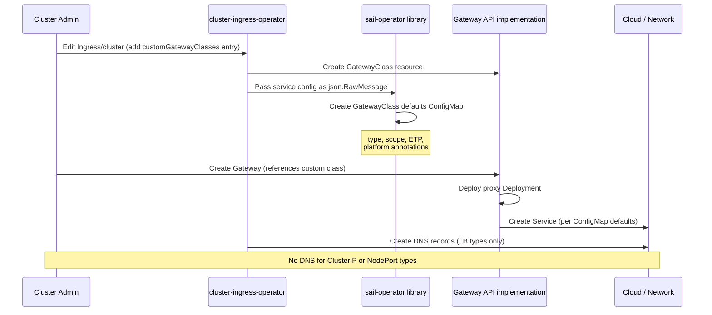

# Gateway API Gateway Customization

## Summary

This enhancement extends the `operator.openshift.io/v1alpha1` `Ingress`
singleton (introduced by the Gateway API CRD management mode
enhancement) with a `spec.gatewayAPI.customGatewayClasses` field that
allows cluster administrators to declaratively define user-managed
GatewayClasses with customized service topology and proxy resource
configuration. For each entry, the Cluster Ingress Operator (CIO)
creates a GatewayClass resource and a corresponding GatewayClass
defaults ConfigMap that the Gateway API implementation uses when
provisioning the Gateway's backing Service and proxy deployment.

This replaces a previous proposal that created a fixed set of
hardcoded GatewayClasses (`openshift-external`, `openshift-internal`,
`openshift-clusterip`). The `customGatewayClasses` approach is more
flexible, supports NodePort services and resource customization, and
does not require code changes to support new configurations.

## Motivation

When a user creates a Gateway using the `openshift-default`
GatewayClass, the Gateway API implementation always provisions an
external LoadBalancer service. There is currently no supported,
declarative way to:

- Provision a Gateway backed by an internal LoadBalancer (for
  traffic that should not be publicly exposed)
- Provision a Gateway backed by a ClusterIP service (for cluster-
  internal traffic, or to front with an OCP Route on bare-metal
  without a hardware load balancer)
- Provision a Gateway backed by a NodePort service (for bring-your-
  own-load-balancer topologies on bare-metal or on-premises clusters)
- Configure `externalTrafficPolicy` to preserve source IP and avoid
  cross-zone hops in stretched or zone-aware cluster topologies
- Tune resource requests and limits for the gateway proxy containers

Users who need these configurations today must either manually patch
the Service after creation (fragile, unsupported), use a private
Gateway API infrastructure field (unsupported, private API), or open
a support exception. All three workarounds are unsuitable for
production use.

### User Stories

#### Story 1: Internal LoadBalancer Gateway

As a cluster administrator, I want to create a GatewayClass that
provisions Gateways with an internal LoadBalancer service, including
the platform-specific internal annotations that CIO already applies
to internal IngressControllers, so that I can expose services only
within my cloud provider's private network without manual patching.

#### Story 2: ClusterIP Gateway on Bare Metal

As a cluster administrator running on bare metal without a hardware
load balancer, I want to create a GatewayClass that provisions
Gateways with a ClusterIP service so that I can front the Gateway
with an OCP Route, reusing the existing HAProxy-based ingress
infrastructure without introducing additional infrastructure
dependencies.

#### Story 3: NodePort Gateway with Bring-Your-Own Load Balancer

As a cluster administrator on an on-premises cluster, I want to
create a GatewayClass that provisions Gateways with a NodePort
service so that I can integrate with my existing hardware load
balancer without requiring a cloud provider or MetalLB.

#### Story 4: Zone-Aware External Gateway

As a cluster administrator running a cluster stretched across
multiple availability zones with BGP-based networking, I want to
configure `externalTrafficPolicy: Local` on my external Gateway
so that traffic arriving in a given zone is served by the Envoy
pod in that same zone, avoiding cross-zone hops and preserving
source IP.

#### Story 5: Proxy Resource Tuning

As a platform engineer managing production Gateway deployments,
I want to configure resource requests and limits for the gateway
proxy containers so that I can right-size the Envoy proxy deployment
for my workload's traffic volume without relying on implementation
defaults.

#### Story 6: Operations at Scale

As a platform engineer managing multiple clusters, I want Gateway
customization to be declarative and managed by CIO so that I can
rely on consistent service configurations across clusters, monitor
GatewayClass provisioning health through existing operator conditions,
and not perform manual configuration steps after cluster upgrade.

### Goals

- Allow cluster administrators to define user-managed GatewayClasses
  with configurable service topology (LoadBalancer external/internal,
  NodePort, ClusterIP) via the `Ingress` operator singleton API.
- Allow configuration of `externalTrafficPolicy` per GatewayClass for
  LoadBalancer and NodePort service types.
- Allow configuration of proxy container resource requests and limits
  per GatewayClass.
- CIO derives platform-specific service annotations (cloud provider
  LB annotations, OVN local-with-fallback) automatically from the
  cluster infrastructure, as it does for IngressControllers.
- CIO manages DNS for GatewayClasses with LoadBalancer service types,
  and explicitly does not manage DNS for ClusterIP or NodePort types.
- Define a simplified ValidatingAdmissionPolicy that reserves the
  `openshift-` GatewayClass name prefix for GatewayClasses using the
  OpenShift controller name, without a hardcoded name allowlist.
- The existing `openshift-default` GatewayClass behavior is
  unchanged.
- Support backporting to prior OCP releases that include the required
  Gateway API implementation version with GatewayClass defaults
  ConfigMap support.

### Non-Goals

- Customizing the `openshift-default` GatewayClass. It continues to
  provision an external LoadBalancer with platform defaults.
- Exposing arbitrary Service annotations in the API. Users can
  annotate Gateway resources directly; the Gateway API implementation
  propagates annotations to the Service.
- Per-Gateway resource overrides. `customGatewayClasses` configures
  class-level defaults applied to all Gateways referencing the class.
- Gateway API implementation configuration (logging format, Istio
  control plane settings). These are managed at the implementation
  level, not per GatewayClass.
- HPA configuration (deferred to a follow-up).
- Node placement configuration (deferred to a follow-up).
- `trafficDistribution` field on the Service. Analysis shows it is
  effectively a no-op for the primary use cases: when
  `externalTrafficPolicy: Local` is set, it is superseded; when not
  set, it only affects in-cluster ClusterIP traffic to the Gateway,
  which is not a typical access pattern.

## Proposal

The `GatewayAPIIngressConfig` struct in the
`operator.openshift.io/v1alpha1` `Ingress` resource is extended with
a `customGatewayClasses` field. Each entry declares a GatewayClass
that CIO will create and manage, along with the service topology
and proxy resource configuration for Gateways that reference it.

For each entry, CIO:

1. Creates or updates a `gateway.networking.k8s.io/v1` `GatewayClass`
   resource with `controllerName:
   openshift.io/gateway-controller/v1`.
2. Builds a GatewayClass defaults ConfigMap and passes it to the
   sail-operator library (the same mechanism CIO uses for HPA
   provisioning), which creates or updates the ConfigMap. The
   ConfigMap is consumed by the Gateway API implementation to set
   service type, platform-specific annotations, and
   `externalTrafficPolicy` on Gateways referencing this class.
3. Manages DNS for the Gateway's listeners when `serviceType` is
   `LoadBalancerService` (same as `openshift-default`).

Platform-specific service annotations (AWS NLB, internal LB
annotations per cloud provider, OVN `local-with-fallback`) are
derived automatically from the cluster's infrastructure platform,
reusing the existing IngressController annotation-derivation logic.
Users do not need to specify platform annotations explicitly.

The existing hardcoded `openshift-default` GatewayClass remains
unchanged. `customGatewayClasses` entries supplement it rather than
replace it.

### Workflow Description

**cluster administrator** is a human user responsible for managing
the cluster and Gateway infrastructure.

**application developer** is a human user responsible for deploying
applications and creating HTTPRoutes.

#### Creating an Internal LoadBalancer Gateway (example workflow)

1. The cluster administrator edits the `Ingress/cluster` singleton:

   ```yaml
   apiVersion: operator.openshift.io/v1alpha1
   kind: Ingress
   metadata:
     name: cluster
   spec:
     gatewayAPI:
       customGatewayClasses:
       - name: openshift-internal
         endpointPublishingStrategy:
           type: LoadBalancerService
           loadBalancer:
             scope: Internal
             endpointTrafficPolicy: Local
   ```

2. CIO detects the new entry and creates the `openshift-internal`
   GatewayClass resource with `controllerName:
   openshift.io/gateway-controller/v1`.
3. CIO builds the GatewayClass defaults ConfigMap with:
   - `service.type: LoadBalancer`
   - Platform internal LB annotation (e.g.,
     `service.beta.kubernetes.io/aws-load-balancer-internal: "true"`
     on AWS)
   - `service.externalTrafficPolicy: Local`
   - OVN `local-with-fallback` annotation (where applicable)
4. CIO passes the ConfigMap configuration to the sail-operator
   library, which creates `openshift-internal-gwc-params` ConfigMap
   in the `openshift-ingress` namespace.
5. The cluster administrator creates a Gateway:

   ```yaml
   apiVersion: gateway.networking.k8s.io/v1
   kind: Gateway
   metadata:
     name: my-internal-gateway
     namespace: my-namespace
   spec:
     gatewayClassName: openshift-internal
     listeners:
     - name: https
       port: 443
       protocol: HTTPS
   ```

6. The Gateway API implementation provisions an Envoy proxy Deployment
   and an internal LoadBalancer Service using the defaults from the
   ConfigMap.
7. CIO manages DNS for the Gateway's listeners.
8. The application developer creates HTTPRoutes attached to the
   Gateway.

#### Creating a ClusterIP Gateway (bare-metal / OCP Route topology)

1. The cluster administrator adds a ClusterIP entry:

   ```yaml
   spec:
     gatewayAPI:
       customGatewayClasses:
       - name: openshift-clusterip
         endpointPublishingStrategy:
           type: ClusterIPService
   ```

2. CIO creates the GatewayClass and a ConfigMap with
   `service.type: ClusterIP`.
3. The cluster administrator creates a Gateway referencing
   `openshift-clusterip`.
4. The Gateway API implementation provisions an Envoy proxy Deployment
   and a ClusterIP Service. No cloud LB is created.
5. CIO does **not** provision DNS for ClusterIP gateways.
6. The cluster administrator creates an OCP Route pointing at the
   ClusterIP Service to expose the Gateway externally via HAProxy.

#### Creating a NodePort Gateway (bring-your-own load balancer)

1. The cluster administrator adds a NodePort entry:

   ```yaml
   spec:
     gatewayAPI:
       customGatewayClasses:
       - name: openshift-nodeport
         endpointPublishingStrategy:
           type: NodePortService
           nodePort:
             endpointTrafficPolicy: Local
   ```

2. CIO creates the GatewayClass and a ConfigMap with
   `service.type: NodePort` and
   `service.externalTrafficPolicy: Local`.
3. The cluster administrator creates a Gateway referencing
   `openshift-nodeport`.
4. The Gateway API implementation provisions a NodePort Service.
   The `spec.healthCheckNodePort` field is set automatically by
   Kubernetes when `externalTrafficPolicy: Local`.
5. CIO does **not** provision DNS.
6. The cluster administrator configures their external load balancer
   to use `spec.healthCheckNodePort` for health checking, ensuring
   traffic is only sent to nodes with a local Envoy pod.



### API Extensions

This enhancement extends the existing
`operator.openshift.io/v1alpha1` `Ingress` CRD. It does not
introduce new CRD types.

#### New fields on `GatewayAPIIngressConfig`

```go
type GatewayAPIIngressConfig struct {
    // managementMode (existing, unchanged)
    ManagementMode GatewayAPIManagementMode `json:"managementMode,omitempty"`

    // customGatewayClasses defines a list of GatewayClasses that CIO
    // creates and manages. For each entry, CIO creates a GatewayClass
    // resource and a GatewayClass defaults ConfigMap that the Gateway
    // API implementation uses when provisioning Gateways of that class.
    //
    // GatewayClass-level settings are defaults applied to all Gateways
    // referencing the class. Individual Gateway instances cannot
    // override class-level settings.
    //
    // +optional
    // +listType=map
    // +listMapKey=name
    // +kubebuilder:validation:MaxItems=16
    CustomGatewayClasses []CustomGatewayClassConfig `json:"customGatewayClasses,omitempty"`
}
```

#### `CustomGatewayClassConfig`

```go
// CustomGatewayClassConfig defines a user-managed GatewayClass and
// its associated configuration.
type CustomGatewayClassConfig struct {
    // name is the name of the GatewayClass to create. Must use the
    // "openshift-" prefix. The name "openshift-default" is reserved
    // and may not be used here.
    //
    // +required
    // +kubebuilder:validation:MinLength=12
    // +kubebuilder:validation:Pattern=`^openshift-[a-z0-9]([a-z0-9\-]*[a-z0-9])?$`
    // +kubebuilder:validation:XValidation:rule="self != 'openshift-default'",message="openshift-default is reserved"
    Name string `json:"name"`

    // endpointPublishingStrategy defines how the Gateway's endpoints
    // are published to the network. When omitted, defaults to an
    // external LoadBalancer with platform defaults.
    //
    // +optional
    EndpointPublishingStrategy *GatewayEndpointPublishingStrategy `json:"endpointPublishingStrategy,omitempty"`

    // resources configures resource requests and limits for the
    // gateway proxy containers. When omitted, the Gateway API
    // implementation's defaults apply.
    //
    // +optional
    Resources *corev1.ResourceRequirements `json:"resources,omitempty"`
}
```

#### `GatewayEndpointPublishingStrategy`

```go
// GatewayEndpointPublishingStrategy defines how a Gateway's endpoints
// are published. It is a discriminated union on Type.
//
// +union
// +kubebuilder:validation:XValidation:rule="self.type != 'LoadBalancerService' || has(self.loadBalancer)",message="loadBalancer is required when type is LoadBalancerService"
// +kubebuilder:validation:XValidation:rule="self.type == 'LoadBalancerService' || !has(self.loadBalancer)",message="loadBalancer is only valid when type is LoadBalancerService"
// +kubebuilder:validation:XValidation:rule="self.type == 'NodePortService' || !has(self.nodePort)",message="nodePort is only valid when type is NodePortService"
type GatewayEndpointPublishingStrategy struct {
    // type is the publishing strategy to use.
    //
    // LoadBalancerService provisions a cloud or hardware LoadBalancer
    // Service in front of the gateway proxy. CIO applies
    // platform-specific annotations and manages DNS automatically.
    //
    // NodePortService provisions a Kubernetes NodePort Service.
    // No DNS is managed by CIO. The cluster administrator is
    // responsible for configuring an external load balancer and, when
    // endpointTrafficPolicy is Local, directing it to use the
    // Service's healthCheckNodePort for health checking.
    //
    // ClusterIPService provisions a ClusterIP Service. The gateway
    // is accessible only within the cluster. No DNS is managed by
    // CIO. Useful for fronting with an OCP Route on bare-metal
    // clusters without a hardware or software load balancer.
    //
    // +unionDiscriminator
    // +required
    // +kubebuilder:validation:Enum=LoadBalancerService;NodePortService;ClusterIPService
    Type GatewayEndpointPublishingStrategyType `json:"type"`

    // loadBalancer holds parameters for the load balancer.
    // Present only when type is LoadBalancerService.
    //
    // +optional
    LoadBalancer *GatewayLoadBalancerStrategy `json:"loadBalancer,omitempty"`

    // nodePort holds parameters for the NodePort service.
    // Present only when type is NodePortService.
    //
    // +optional
    NodePort *GatewayNodePortStrategy `json:"nodePort,omitempty"`
}

// GatewayEndpointPublishingStrategyType is the publishing strategy
// for a Gateway.
type GatewayEndpointPublishingStrategyType string

const (
    // GatewayStrategyLoadBalancerService provisions a LoadBalancer
    // Service and manages DNS.
    GatewayStrategyLoadBalancerService GatewayEndpointPublishingStrategyType = "LoadBalancerService"

    // GatewayStrategyNodePortService provisions a NodePort Service.
    // No DNS is managed by CIO.
    GatewayStrategyNodePortService GatewayEndpointPublishingStrategyType = "NodePortService"

    // GatewayStrategyClusterIPService provisions a ClusterIP Service.
    // No DNS is managed by CIO.
    GatewayStrategyClusterIPService GatewayEndpointPublishingStrategyType = "ClusterIPService"
)

// GatewayLoadBalancerStrategy holds parameters for a LoadBalancer-
// backed GatewayClass.
type GatewayLoadBalancerStrategy struct {
    // scope indicates whether the load balancer is exposed
    // externally or only within the cloud provider's private
    // network.
    //
    // External provisions a public-facing load balancer with
    // platform-specific external annotations.
    //
    // Internal provisions an internal load balancer with
    // platform-specific internal annotations (e.g.,
    // service.beta.kubernetes.io/aws-load-balancer-internal).
    //
    // +required
    Scope LoadBalancerScope `json:"scope"` // reuses operator/v1 type

    // endpointTrafficPolicy controls how external traffic is
    // distributed to gateway proxy pods.
    //
    // Local routes external traffic only to proxy pods on the same
    // node that receives the traffic. This preserves the source IP
    // address and avoids cross-node (and cross-zone) hops.
    // The load balancer must use the Service's healthCheckNodePort
    // to health-check nodes; CIO configures this automatically for
    // cloud load balancers via platform annotations. The OVN
    // local-with-fallback annotation is also set when Local is used,
    // ensuring traffic is not dropped when no local pod is available
    // during rolling updates.
    //
    // Cluster allows the implementation to route external traffic to
    // any proxy pod in the cluster, performing SNAT. Source IP is
    // not preserved.
    //
    // When omitted, defaults to Local on most platforms. IBM Cloud
    // defaults to Cluster due to platform constraints.
    //
    // +optional
    EndpointTrafficPolicy *GatewayEndpointTrafficPolicy `json:"endpointTrafficPolicy,omitempty"`
}

// GatewayNodePortStrategy holds parameters for a NodePort-backed
// GatewayClass.
type GatewayNodePortStrategy struct {
    // endpointTrafficPolicy controls how external traffic is
    // distributed to gateway proxy pods.
    //
    // Local routes external traffic only to proxy pods on the same
    // node that receives the traffic. This preserves the source IP
    // address and avoids cross-node hops. When Local is used, the
    // external load balancer MUST be configured to health-check
    // nodes using Service.spec.healthCheckNodePort. If the load
    // balancer does not perform this health check, traffic will be
    // dropped on nodes that have no local proxy pod.
    //
    // Cluster allows routing to any proxy pod (with SNAT). Source
    // IP is not preserved, but load distribution is even regardless
    // of pod placement.
    //
    // When omitted, this field is not set (the implementation
    // default applies). Unlike LoadBalancerService, there is no
    // platform-specific default because NodePort is used in
    // bring-your-own-load-balancer scenarios where the external LB
    // capabilities vary widely.
    //
    // +optional
    EndpointTrafficPolicy *GatewayEndpointTrafficPolicy `json:"endpointTrafficPolicy,omitempty"`
}

// GatewayEndpointTrafficPolicy is the externalTrafficPolicy for a
// Gateway's Service.
// +kubebuilder:validation:Enum=Local;Cluster
type GatewayEndpointTrafficPolicy string

const (
    // GatewayEndpointTrafficPolicyLocal routes external traffic only
    // to pods on the same node, preserving source IP.
    GatewayEndpointTrafficPolicyLocal GatewayEndpointTrafficPolicy = "Local"

    // GatewayEndpointTrafficPolicyCluster routes external traffic to
    // any pod, performing SNAT.
    GatewayEndpointTrafficPolicyCluster GatewayEndpointTrafficPolicy = "Cluster"
)
```

#### ValidatingAdmissionPolicy Changes

The existing VAP for GatewayClass naming is simplified to two rules:

1. A GatewayClass with `controllerName:
   openshift.io/gateway-controller/v1` MUST have a name prefixed
   with `openshift-`.
2. A GatewayClass with the `openshift-` name prefix MUST use
   `controllerName: openshift.io/gateway-controller/v1`.

The previous allowlist of exactly four names is removed. CIO creates
GatewayClasses for `openshift-default` (hardcoded) and any entry in
`customGatewayClasses`. A GatewayClass manually created by a user
with the `openshift-` prefix and the OpenShift controller name is
permitted but not managed by CIO (no defaults ConfigMap is created
for it).

#### YAML examples

```yaml
# External LoadBalancer with zone-aware routing
apiVersion: operator.openshift.io/v1alpha1
kind: Ingress
metadata:
  name: cluster
spec:
  gatewayAPI:
    customGatewayClasses:
    - name: openshift-external
      endpointPublishingStrategy:
        type: LoadBalancerService
        loadBalancer:
          scope: External
          endpointTrafficPolicy: Local

    # Internal LoadBalancer (default ETP for platform)
    - name: openshift-internal
      endpointPublishingStrategy:
        type: LoadBalancerService
        loadBalancer:
          scope: Internal

    # ClusterIP for bare-metal + OCP Route topology
    - name: openshift-clusterip
      endpointPublishingStrategy:
        type: ClusterIPService

    # NodePort for bring-your-own load balancer
    - name: openshift-nodeport
      endpointPublishingStrategy:
        type: NodePortService
        nodePort:
          endpointTrafficPolicy: Local

    # High-traffic class with tuned proxy resources
    - name: openshift-production
      endpointPublishingStrategy:
        type: LoadBalancerService
        loadBalancer:
          scope: External
          endpointTrafficPolicy: Local
      resources:
        requests:
          cpu: 500m
          memory: 512Mi
        limits:
          memory: 1Gi
```

### Topology Considerations

#### Hypershift / Hosted Control Planes

This enhancement applies to Hypershift without additional
considerations beyond existing Gateway API support. GatewayClass
provisioning and the Gateway API implementation run in the guest
cluster. Platform-specific annotations in the GatewayClass defaults
ConfigMap are derived from the guest cluster's infrastructure
platform.

#### Standalone Clusters

Directly applicable. Platform annotation derivation uses the same
logic as CIO's IngressController service provisioning.

#### Single-node Deployments or MicroShift

`ClusterIPService` GatewayClasses are particularly useful for SNO
deployments where cloud load balancers are not available. No
additional resource consumption beyond what a Gateway already requires.

MicroShift has its own Gateway API support and does not use CIO, so
this enhancement does not apply to MicroShift.

#### OpenShift Kubernetes Engine

Applicable on OKE clusters where Gateway API is available, subject
to the same OSSM version dependency as for standard OCP.

### Implementation Details/Notes/Constraints

#### GatewayClass Defaults ConfigMap Mechanism

The GatewayClass defaults ConfigMap is an Istio mechanism documented
at https://istio.io/latest/docs/tasks/traffic-management/ingress/gateway-api/#gatewayclass-defaults.
One ConfigMap is created per GatewayClass entry (not per Gateway
instance). All Gateways referencing a given GatewayClass share the
same defaults.

CIO passes service configuration as `json.RawMessage` to the
sail-operator library, which creates the ConfigMap. This is the same
mechanism CIO uses for HPA provisioning. The required support in the
Gateway API implementation was added in OSSM >= 3.2.4 and >= 3.3.1
(sail-operator#1465). Backport to OCP versions using OSSM 3.0.x or
3.1.x is not possible without an upstream cherry-pick.

#### Platform Annotation Derivation

CIO reuses its existing IngressController annotation-derivation logic
to populate the GatewayClass defaults ConfigMap with the correct
platform-specific service annotations. The derivation is based on:

- `scope: External` or `scope: Internal` (from the API)
- The cluster's `infrastructure.config.openshift.io/cluster` platform
  type (AWS, Azure, GCP, IBM, OpenStack, etc.)
- `endpointTrafficPolicy: Local` triggers the OVN
  `traffic-policy.network.alpha.openshift.io/local-with-fallback: ""`
  annotation on platforms where it applies.

#### DNS Management

| `type`               | CIO manages DNS |
|----------------------|-----------------|
| `LoadBalancerService`| Yes             |
| `NodePortService`    | No              |
| `ClusterIPService`   | No              |

#### Deletion Semantics

When an entry is removed from `customGatewayClasses`, CIO removes
the GatewayClass defaults ConfigMap but does not delete the
GatewayClass resource itself. Deleting the GatewayClass while
Gateways reference it would orphan running workloads. CIO sets a
condition on the GatewayClass (`Accepted: False`, reason:
`NoLongerManaged`) and records a corresponding condition on
`Ingress/cluster` status to notify the administrator. The
administrator is responsible for deleting the GatewayClass after
migrating or deleting dependent Gateways.

#### Feature Gate

This enhancement is gated behind a new feature gate
`CustomGatewayClasses`, initially added to `TechPreviewNoUpgrade`
in `github.com/openshift/api/features/features.go`. The feature gate
marker `+openshift:enable:FeatureGate=CustomGatewayClasses` is added
to the relevant API fields.

### Risks and Mitigations

**Risk**: OSSM version dependency. The GatewayClass defaults ConfigMap
mechanism requires OSSM >= 3.2.4 or >= 3.3.1.

**Mitigation**: CIO checks the OSSM version at reconciliation time and
sets a `Degraded` condition on `Ingress/cluster` with a clear message
if the version requirement is not met. The feature gate prevents the
API from being available until the cluster meets the version
requirement on supported OCP releases.

**Risk**: Uneven load distribution with `endpointTrafficPolicy: Local`
on NodePort GatewayClasses when pods are not distributed evenly
across nodes.

**Mitigation**: The API documentation for `NodePortService` +
`endpointTrafficPolicy: Local` explicitly states the health check
NodePort requirement and the load-distribution trade-off. Future work
(topology spread constraints via `nodePlacement`) will allow operators
to ensure even pod distribution.

**Risk**: A user removes a `customGatewayClasses` entry while Gateways
still reference the GatewayClass, expecting the GatewayClass to be
deleted.

**Mitigation**: CIO does not delete the GatewayClass on entry removal
(documented above). A clear condition is set to guide the
administrator. Future work may add a deletion policy field.

### Drawbacks

- `customGatewayClasses` settings are class-level defaults applied to
  all Gateways referencing the class. A small development Gateway and
  a high-traffic production Gateway referencing the same class share
  the same resource defaults and service topology. Administrators must
  create separate GatewayClasses for different workload tiers.
- The `openshift-` prefix requirement for all CIO-managed GatewayClass
  names may feel restrictive, but it is necessary to ensure CIO's
  controller name association is valid and that the prefix reservation
  VAP can enforce it consistently.

## Alternatives (Not Implemented)

### Hardcoded GatewayClasses

The prior proposal created three fixed GatewayClasses
(`openshift-external`, `openshift-internal`, `openshift-clusterip`).
This approach was rejected because:

- A hardcoded allowlist requires a code change for every new
  service configuration combination.
- NodePort support and resource customization were explicitly deferred
  as open questions with no clear path forward.
- `externalTrafficPolicy` was not user-configurable; only the
  platform-derived default applied.
- The VAP allowlist with four fixed names is a permanent maintenance
  burden.

## Open Questions

1. **Status per GatewayClass**: Should `Ingress/cluster` status
   include a `gatewayClasses[]` slice with one entry per
   `customGatewayClasses` entry, or is it sufficient to rely on
   the GatewayClass resource's own `.status.conditions`? The latter
   avoids duplicating status but requires administrators to query
   GatewayClass resources separately.

2. **Default `endpointPublishingStrategy`**: When
   `endpointPublishingStrategy` is omitted from an entry, should the
   default be `LoadBalancerService` with `scope: External` (matching
   `openshift-default` behavior), or should it be required?

3. **Deletion policy field**: Should we add a
   `deletionPolicy: Delete|Retain` field to `CustomGatewayClassConfig`
   to give administrators explicit control over whether CIO deletes
   the GatewayClass when the entry is removed?

## Test Plan

<!-- TODO: Fill in test plan before targeting a release. -->

Tests must include:

- `[OCPFeatureGate:CustomGatewayClasses]` label for the feature gate
- `[Jira:"OCP/Network Ingress"]` label for the component
- Unit tests for CIO controller logic (ConfigMap content derivation,
  platform annotation selection per service type and scope)
- E2E tests for each `endpointPublishingStrategy.type`:
  - `LoadBalancerService` External and Internal on supported cloud
    platforms
  - `NodePortService` on applicable platforms
  - `ClusterIPService` with OCP Route fronting
- E2E tests verifying `externalTrafficPolicy: Local` behavior
  (source IP preservation, health check NodePort set)
- E2E tests verifying `resources` propagation to the proxy container
- Upgrade tests: existing `openshift-default` GatewayClass unaffected
  after upgrade
- Tests must run on all supported platforms: AWS, Azure, GCP,
  vSphere, Baremetal

## Graduation Criteria

### Dev Preview -> Tech Preview

- E2E tests passing on at least AWS and bare-metal platforms
- OSSM version validation implemented and tested
- End-user documentation draft
- Minimum 5 tests, 7 runs per week, 95% pass rate

### Tech Preview -> GA

- E2E tests on all supported platforms with ≥14 runs per platform
- Upgrade and downgrade testing complete
- SLIs defined and telemetry collected
- User-facing documentation complete in openshift-docs
- Deletion semantics validated in upgrade scenarios

## Upgrade / Downgrade Strategy

**Upgrade**: The `customGatewayClasses` field defaults to empty. No
existing GatewayClass or Gateway resources are modified on upgrade.
`openshift-default` behavior is unchanged.

**Downgrade**: If a cluster is downgraded to a version that does not
support `customGatewayClasses`, CIO stops reconciling the entries but
does not delete any GatewayClass or ConfigMap resources it previously
created. Those resources remain functional until an administrator
manually removes them. This is consistent with how CIO handles other
feature gate removals.

## Version Skew Strategy

The GatewayClass defaults ConfigMap mechanism requires the Gateway API
implementation to be at a minimum version (OSSM >= 3.2.4 / >= 3.3.1).
CIO detects the implementation version at reconciliation time and
reports a condition rather than attempting to create ConfigMaps that
the implementation version cannot consume. No version skew between
CIO and the kube-apiserver is anticipated, as this enhancement adds
fields to an existing CRD.

## Operational Aspects of API Extensions

The `customGatewayClasses` field is added to the existing
`Ingress/cluster` CRD. The CRD is managed by CIO and protected by an
existing VAP. The field is gated by a feature gate and therefore
invisible to clusters that have not enabled `TechPreviewNoUpgrade`.

Failure modes:

- **OSSM version too old**: CIO sets `Degraded` condition on
  `Ingress/cluster` with reason `GatewayClassDefaultsUnsupported`.
  Existing Gateways continue to function; new `customGatewayClasses`
  entries are not reconciled.
- **ConfigMap creation failure**: CIO retries and degrades with a
  condition. The GatewayClass resource may exist without a ConfigMap;
  Gateways referencing it will use implementation defaults rather than
  the intended configuration.

## Support Procedures

- Check `Ingress/cluster` status conditions for
  `GatewayClassDefaultsUnsupported` or `GatewayClassReconcileFailed`.
- Check the GatewayClass resource's `.status.conditions` for
  `Accepted` status.
- CIO logs include structured events for each `customGatewayClasses`
  reconciliation pass.
- To disable: remove entries from `customGatewayClasses`. CIO stops
  managing the ConfigMap; the GatewayClass is retained (see Deletion
  Semantics).

## Infrastructure Needed

No new infrastructure is needed. The implementation uses the existing
sail-operator library integration already used for HPA provisioning.
